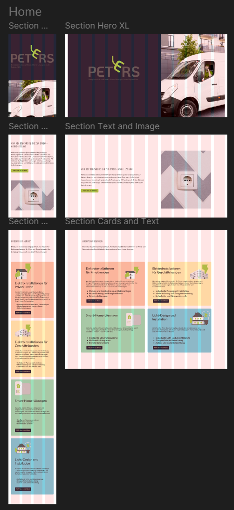
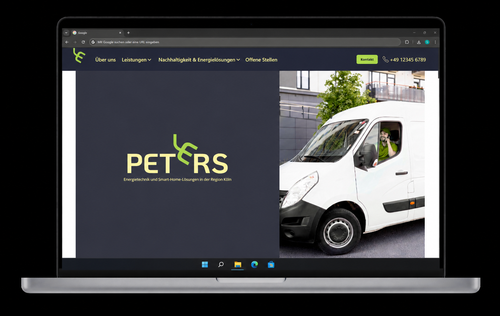

# TEMPLATE - Business & Services Website

A production-ready frontend template for small service businesses, built with **React** and **TypeScript**. Demonstrated live as [Peters Elektro GmbH](https://peters-elektro.netlify.app/).

---

## Demo

**[peters-elektro.netlify.app](https://peters-elektro.netlify.app/)**

---

## Screenshots

### Responsive layout — mobile and desktop


*Section components: Hero XL, Text and Image, Cards and Text — mobile and desktop breakpoints*

### Live deployment


*Deployed on Netlify — peters-elektro.netlify.app*

---

## Design Process

This project started in Figma before a single line of code was written:

- **CI moodboard** — typography, color palette, visual references
- **Grid mockup** — section layout and content structure across breakpoints
- **Component specs** — responsive navbar with dropdown states (mobile + desktop)

---

## About

This template was built as a reusable starting point for local and regional service businesses — such as tradespeople, agencies, or consultants — that need a clean, professional web presence without a heavy CMS.

The Peters Elektro GmbH deployment serves as the reference implementation.

---

## Tech Stack

| Layer | Technology |
|---|---|
| Framework | React |
| Language | TypeScript |
| Styling | Tailwind CSS |
| Bundler | Vite |
| Deployment | Netlify |

---

## Features

- Hero section (`Section_Hero`)
- Services sections with text and image (`Section_Text_and_Image`, `Section_List_and_Image`)
- Card-based content sections (`Section_Text_and_Cards`)
- Contact section (`Section_Contact`)
- Gallery (`Section_Gallery`)
- Emergency repair page (`Notfallreparaturen`)
- Jobs page
- Imprint / legal page (`Section_Impressum`)
- Responsive Navbar with dropdown navigation
- Footer
- Reusable component library: Buttons, Cards, Dropdowns, Expanders, Lists, Text Inputs, Toggles
- Centralized color theming via `cdColors` utility
- Section dividers for layout control

---

## Getting Started

### Prerequisites

- Node.js >= 18
- npm or yarn

### Installation

```bash
git clone https://github.com/Sebastian-Weber/TEMPLATE-business-and-services.git
cd TEMPLATE-business-and-services/frontend
npm install
```

### Development

```bash
npm run dev
```

### Build

```bash
npm run build
```

### Deploy

The project is configured for deployment on [Netlify](https://netlify.com). Connect the repository to a Netlify project and set the build settings:

| Setting | Value |
|---|---|
| Base directory | `frontend` |
| Build command | `npm run build` |
| Publish directory | `frontend/dist` |

---

## Customization

To adapt this template for a new client:

1. Replace company name, logo, and color tokens in the CSS variables / theme file
2. Update copy in the relevant page components
3. Adjust the services list and contact details
4. Swap favicon and `<title>` in `index.html`

---

```
TEMPLATE-business-and-services/
└── frontend/
    ├── src/
    │   ├── assets/           # Images and static files
    │   ├── components/       # Reusable UI components
    │   │   ├── buttons/
    │   │   ├── card/
    │   │   ├── dropdowns/
    │   │   ├── expanders/
    │   │   ├── lists/
    │   │   ├── text inputs/
    │   │   ├── toggles/
    │   │   ├── Footer.tsx
    │   │   ├── Header.tsx
    │   │   ├── Navbar.tsx
    │   │   ├── Outlet.tsx
    │   │   ├── Section_Contact.tsx
    │   │   ├── Section_Divider.tsx
    │   │   ├── Section_Gallery.tsx
    │   │   ├── Section_Hero.tsx
    │   │   ├── Section_Impressum.tsx
    │   │   ├── Section_List_and_Image.tsx
    │   │   ├── Section_Text_and_Cards.tsx
    │   │   ├── Section_Text_and_Image.tsx
    │   │   └── Wrapper_Global.tsx
    │   ├── contexts/
    │   ├── pages/
    │   ├── utils/
    │   ├── App.tsx
    │   ├── App.css
    │   ├── index.css
    │   └── main.tsx
    ├── index.html
    ├── package.json
    ├── tailwind.config.js
    ├── vite.config.ts
    └── tsconfig.json
```

---

## Author

**Sebastian Weber** — UI Designer & Frontend Developer, Cologne

- Portfolio: [sebastian-weber.github.io/uxui-portfolio](https://sebastian-weber.github.io/uxui-portfolio/)
- LinkedIn: [linkedin.com/in/sebastian-weber1708](https://www.linkedin.com/in/sebastian-weber1708)
- GitHub: [@Sebastian-Weber](https://github.com/Sebastian-Weber)

---

## License

MIT
